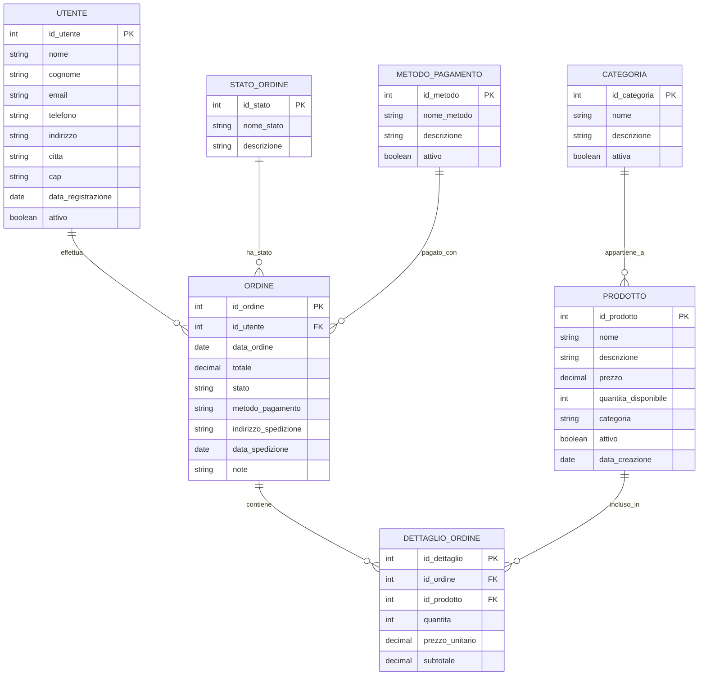
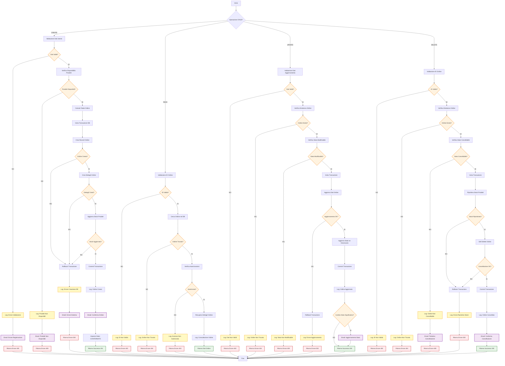

# AGENTS.md - Instructions for AI Agents

This document provides context and guidelines for AI agents working on this project. Please adhere to these rules and use the provided information to understand the system architecture and business logic.

## System Information

- **Timestamp**: 2025-08-20 15:20:42.454928

## Database Schema

Here is the Entity-Relationship diagram for the PostgreSQL database.

## Business Logic Flowchart

This flowchart describes the CRUD operations for orders.

## Technical Guidelines and Coding Standards

These rules are for the **TESTAIGENT** solution.

### 1. Naming Conventions
- **Functions/Methods**: Use CamelCase (`getUserById`, `registerUser`, `calculateScore`).
- **Private Variables, Properties, and Fields**: Use a `_` prefix (`_userRepository`, `_isActive`, `_count`).
- **Other variables**: Use camelCase without a prefix (`userId`, `propertyList`, `score`).
- **Classes, Interfaces, Enums, Records, Types**: Use PascalCase (`UserRepository`, `IUserService`, `UserType`, `PropertyRecord`).

### 1.1 Logging Conventions
- Always use Serilog for logging.
- Use the Seq sink.
- Use file log sinks with daily rotation.

### 2. Code Best Practices
- Write clear, readable, and maintainable code.
- Divide logic into methods and classes with a single responsibility (SRP).
- Use architectural patterns (CQRS, Repository, UnitOfWork, Extension Method).
- Always validate input/output (ModelState, attributes, FluentValidation).
- Handle errors and logging in a centralized and advanced way (Serilog, ILogger, audit, try/catch, standard HTTP responses).
- Mandatory logging for errors, warnings, info, and audit trails.
- Use standardized HTTP responses (BadRequest, Unauthorized, NotFound, etc.).
- Use XML documentation on controllers, services, and middleware.
- Keep documentation and comments updated with every change.

### 3. Cache and Data Access Management

#### 3.1 Repository Pattern with Cache
- Every repository must have its corresponding CacheRepository that implements the Cache-Aside pattern.
- The CacheRepository receives both the base Repository and the RedisCacheRepository via Dependency Injection.
- **Mandatory read flow**: CacheRepository → check cache → if not present, Repository → save to cache.
- **Mandatory write flow**: Repository for CRUD operations → invalidate/update cache.

#### 3.2 Layered Architecture for Data Access
- **API Layer**: Can only call a Service or CacheRepository, never a Repository directly.
- **Service Layer**: Can call CacheRepository or Repository as needed.
- **CacheRepository**: The single point of access that combines cache and repository.
- **Repository**: Exclusive access to the database via DbContext.
- **Strictly forbidden**: Direct database connections outside of Repositories.

#### 3.3 Cache Implementation
- Use appropriate TTL (Time To Live) for each data type.
- Handle cache miss cases with a fallback to the database.
- Implement cache invalidation strategies for write operations.
- Mandatory logging for cache hits/misses and invalidation operations.

#### 3.4 Database Connection Management
- **Only Repositories** can directly access the DbContext.
- Always use `AsNoTracking()` for read-only operations.
- Manage database transactions exclusively in Repositories.
- Implement retry logic for critical operations.

### 4. Commenting requirements
- **Classes, Interfaces, Records, Types, Enums**: Every element must have an XML comment describing its purpose and usage.
- **Public methods and properties**: Comment with XML doc, describing parameters, returns, and exceptions.
- **Private methods and variables**: Comment only if the logic is not immediately understandable.
- **Update comments** with every significant change.
- **The entire solution is now documented with XML comments on every main source file (August 2025).**

### 5. Configuration Standards
- Use common configuration files (`appsettings.json`, `appsettings.Development.json`, etc.).
- Define configuration keys consistently and document them.
- Centralize the management of connection strings, security keys, and environment parameters.
- Use Dependency Injection for service configuration.
- Version and document every change to configuration files.

### 6. Application of Standards
- All projects and logical flows in the solution must strictly and mandatorily adhere to these rules.
- For specific needs, document exceptions in the README of the individual project.
- Conduct periodic code reviews to ensure compliance with standards.

---

**Note:**
These rules are mandatory for the entire team and must be kept up to date. Any new convention or change must be integrated into this document and communicated to all project members.

**Last modified:** 19 agosto 2025
